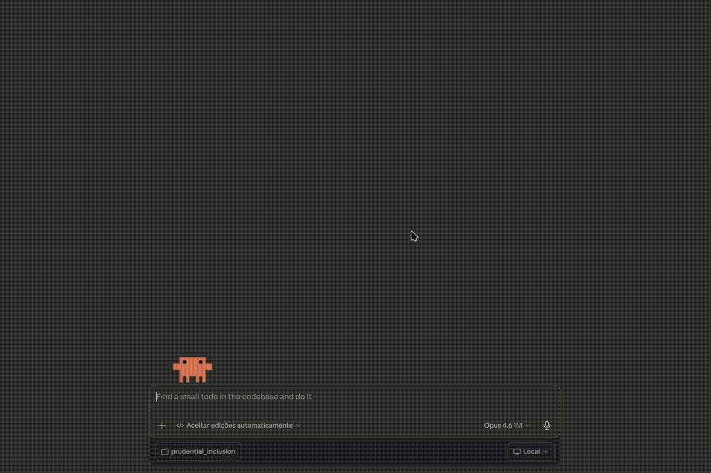
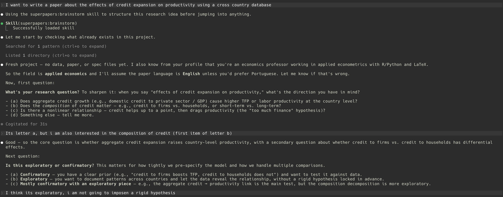

# Superpapers

A Claude Code plugin that uses AI subagents and a Socratic method of human-AI interaction to brainstorm, plan, and execute empirical academic papers. Inspired by the [superpowers](https://github.com/obra/superpowers) plugin philosophy, it brings the same discipline to quantitative research.

- Live presentation: [superpapers](https://regisely.com/superpapers/)
- Example Papers:
  - [credit_and_productivity.pdf](https://regisely.com/superpapers/examples/credit_and_productivity.pdf)
  - [monetary_pass_through.pdf](https://regisely.com/superpapers/examples/monetary_pass_through.pdf)



> **Disclaimer:** Superpapers works with any Claude subscription or API access, but the **Max plan** with the most capable available model and a large context window (1M tokens when available) is recommended — building a publishable academic paper is a token-intensive task. All generated code and paper content should be thoroughly reviewed before publication. Check the AI-use policies of your target journals before submitting and make sure you participate in every decision during the process.

## What It Is

Superpapers adapts the superpowers pipeline (brainstorm → write-plan → execute-plan with subagent-driven development) for the full academic paper lifecycle. It covers everything from ideation to submission: literature search, data collection, statistical modeling, robustness checks, writing, and journal targeting. The pipeline is anchored by a `replication-driven-research` guardrail that replaces test-driven development in the research domain: every number, table, and figure in the paper must be regenerable from raw data by a script with a fixed seed.

The plugin is field-agnostic. Although it is inspired by applied economics and econometrics, the process and tooling work for any empirical quantitative field — political science, sociology, epidemiology, public health, environmental science, quantitative psychology, and more. Methods, data sources, and journal suggestions are not constrained to a fixed list; the plugin adapts to the research question.

Superpapers is a standalone plugin with no dependencies on superpowers or any other Claude Code plugin. Plugin internals (skills, scripts, templates, comments) are English-only, but the plugin produces paper content (sections, tables, captions) in whatever language the user chooses for their paper.

## Installation

First, add the marketplace source from GitHub:

```
/plugin marketplace add regisely/superpapers
```

Then install the plugin:

```
/plugin install superpapers
```

Claude Code accepts a GitHub repo directly as the marketplace source. After installation, the skills become available automatically when you discuss research tasks.

## Usage

After installation, just tell Claude what you want to research. The plugin skills activate based on the conversation context, and the orchestration workflow explicitly loads `academic-baseline` first for research stages:

```
I want to write a paper on the effect of wildfire smoke exposure on emergency room visits.
```

```
Help me find recent papers on incumbency advantage in mayoral elections, verified via DOI.
```

```
Run a staggered DiD on this panel of state-level policy adoptions from 2010 to 2024.
```

You can also use explicit slash commands to enter the workflow at a specific stage:

```
/superpapers:brainstorm
/superpapers:write-plan
/superpapers:execute-plan
/superpapers:write-paper
/superpapers:paper-review
```

The `write-paper` command applies the `paper-writing` skill directly to drafting, rewriting, reviewing, or auditing prose for any section (Abstract, Introduction, Methods, Results, Conclusion) or specialized output (job market paper, grant proposal, policy brief, referee response).

Advanced users who want to pre-populate project settings, declare a code language preference, or add explicit rules and preferences can optionally run:

```
/superpapers:init
```

This writes `CLAUDE.superpapers.md` in the current paper folder with fields like research question, paper language, target journals, and significance convention. The plugin does not require this command — every skill reads `CLAUDE.superpapers.md` on activation when it exists, and asks for settings inline when it does not.

<a id="demonstration"></a>
## Demonstration

The full walkthrough lives in the interactive presentation. It follows the same real Claude Code session from brainstorm to submission, including failed identification, pivot, robustness, and final manuscript formatting.

The demo is not a scripted toy example. It walks through a real Claude Code session in which:

- the project starts from a concrete empirical question;
- the first identification strategy looks plausible, then fails after estimation;
- the workflow pivots to a second strategy instead of forcing a weak result;
- null results, failed diagnostics, robustness checks, and reframing decisions stay explicit;
- the user remains in the loop for major research decisions.

Stages covered in the live presentation:

- Brainstorm: define the question, research mode, and contribution.
- Design: compare approaches, map data, and lock the identification strategy.
- Plan: expand the research into explicit phased tasks.
- Execute: collect, prepare, estimate, diagnose failure, pivot, and run robustness checks.
- Submit: format the manuscript and verify the submission checklist.

[Open the interactive presentation](https://regisely.github.io/superpapers/)



_Representative moment from a real session: the workflow starts from a concrete research question and asks follow up questions to structure the project before any implementation._

## Skills Overview

Sixteen skills organized by role:

| Skill | Role | Purpose |
|---|---|---|
| `brainstorm` | Orchestration | Socratic exploration of a research idea; produces a design spec |
| `write-plan` | Orchestration | Translates an approved spec into a phased research execution plan |
| `execute-plan` | Orchestration | Runs the plan phase by phase with subagents and two-stage review |
| `academic-baseline` | Foundation | Non-negotiable principles that govern all other skills |
| `replication-driven-research` | Foundation | End-to-end reproducibility guardrail (replaces TDD) |
| `compile-latex` | Foundation | Multi-pass LaTeX compilation with engine and bib detection |
| `literature-search` | Pipeline | Web-verified search across academic databases |
| `citation-management` | Pipeline | BibTeX management via CrossRef API (no Zotero needed) |
| `data-collection` | Pipeline | Data discovery, respectful collection, manifest documentation |
| `statistical-modeling` | Analysis | Open-ended modeling process with method-family references |
| `tables-and-figures` | Analysis | Publication-quality LaTeX tables and vector PDF figures |
| `robustness-checks` | Analysis | Design-appropriate canonical robustness checks |
| `paper-writing` | Writing | Section formulas, style rules, AI-pattern avoidance, 100-point review rubric |
| `paper-review` | Review | Pre-submission holistic audit across text, code, tables, figures, results, citations, and reproducibility; works standalone on external papers |
| `journal-selection` | Submission | Field-agnostic journal matching with tier strategy |
| `journal-guidelines` | Submission | Parses instructions for authors, builds submission checklist |

## Typical Workflow

1. **Start a new project.** Create a new folder for your research and open Claude Code inside it. Just start talking — the plugin infers settings from context and asks inline when something is unknown. Advanced users may also run `/superpapers:init` to persist a `CLAUDE.superpapers.md` file with project settings and custom rules.
2. **Brainstorm.** Ask Claude Code something like "I want to study the effect of X on Y" or invoke `/superpapers:brainstorm`. The `brainstorm` skill activates and asks Socratic questions about your research question, identification strategy, data, and contribution. The output is a design spec saved inside the research project, typically under `docs/superpapers/specs/`.
3. **Plan.** Once the spec is approved, invoke `/superpapers:write-plan` or continue naturally in the conversation. The `write-plan` skill generates a phased research plan (collection, preparation, analysis, robustness, writing, submission) with explicit artifacts, verification criteria, and `Skills involved` routing per task, typically saved inside the research project under `docs/superpapers/plans/`.
4. **Execute.** Invoke `/superpapers:execute-plan` or continue naturally in the conversation. The `execute-plan` skill dispatches subagents per task, verifies after each phase, honors each task's `Skills involved` field, and runs the full pipeline end-to-end before declaring any result final.
5. **Review.** Before submission, run `/superpapers:paper-review` for a holistic pre-submission audit that cross-cuts text, code, tables, figures, results, citations, and reproducibility in one pass and writes a consolidated report to `docs/superpapers/review/`. The `paper-review` skill works standalone as well — it can audit any paper folder, even one written outside the plugin.
6. **Submit.** When the paper is ready, use `journal-selection` to pick a target outlet and `journal-guidelines` to format the paper to that journal's requirements. Journal-facing work is not considered valid without `journal-guidelines`.

Throughout the workflow, `academic-baseline` is invoked first as the standing policy layer, and `replication-driven-research` guarantees the pipeline stays reproducible.

## Project Setup

### Optional: `CLAUDE.superpapers.md`

`CLAUDE.superpapers.md` is optional. When it exists, every superpapers skill reads it on activation — walking up from the current working directory until the file is found — and applies its settings for the session. Without it, skills ask inline for settings they need. The file typically stores field, research question summary, paper language, code language, significance convention, target journals, and any custom rules or preferences the user wants every skill to respect.

To create or update it, advanced users can run:

```
/superpapers:init
```

The command gathers what it can from existing specs, plans, and project context, asks only for high-value missing fields, and writes `CLAUDE.superpapers.md` in the current working directory. Alternatively, copy `templates/CLAUDE.superpapers.md` into the paper folder and fill in the fields manually.

### Single-paper layout

For a single-paper repository, place `CLAUDE.superpapers.md` at the repo root alongside the canonical research structure proposed by `replication-driven-research` on first invocation:

```
project-root/
├── CLAUDE.md                    # optional: repo-wide context (auto-loaded by Claude Code)
├── CLAUDE.superpapers.md        # optional: paper settings and custom rules
├── data/
│   ├── raw/
│   ├── processed/
│   └── manifest.md
├── code/
├── output/
│   ├── tables/
│   ├── figures/
│   └── logs/
└── paper/
    ├── paper.tex
    └── references.bib
```

### Multi-paper layout

For a repository containing multiple papers, keep the canonical structure inside each paper subfolder and place a `CLAUDE.superpapers.md` in each paper's root. The repo root may carry `CLAUDE.md` for context that applies to the whole repository (for example, shared conventions, shared data sources, or author-wide preferences):

```
repo-root/
├── CLAUDE.md                    # optional: repo-wide context (auto-loaded)
├── paper-1/
│   ├── CLAUDE.superpapers.md    # settings specific to paper 1
│   ├── data/
│   ├── code/
│   ├── output/
│   └── paper/
└── paper-2/
    ├── CLAUDE.superpapers.md    # settings specific to paper 2
    ├── data/
    ├── code/
    ├── output/
    └── paper/
```

Skills resolve the right `CLAUDE.superpapers.md` by walking up from the current working directory — so `cd` into the specific paper folder before invoking skills or commands when working in a multi-paper repository.

You can use `templates/paper-skeleton.tex` as a starting point for the paper itself and `templates/replication-readme.md` for the replication package.

## Updating

Claude Code caches marketplace repositories locally, so updating the plugin is a two-step process:

```
/plugin marketplace update superpapers
```

```
/plugin update superpapers
```

The first command refreshes the local clone of the marketplace repository. The second reinstalls the latest plugin version from that refreshed state.

## Language Policy

Plugin internals — SKILL.md files, scripts, templates, code comments, identifiers — are English-only. This keeps the plugin accessible to researchers globally.

Paper content — abstract, sections, table notes, figure captions, output strings — follows the user's chosen paper language. Set `paper_language` in `CLAUDE.superpapers.md` (every skill reads the file on activation) or state it explicitly in the conversation (default: `en`, options include `pt-BR`, `es`, `fr`, and so on). Skills that produce user-facing paper content respect this setting.

Your conversation with Claude Code can happen in any language. Only the plugin internals are fixed to English.

## License and Author

MIT License.

Author: Regis A. Ely (<regisaely@gmail.com>).
