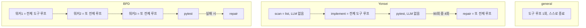

# Research-30 스위트 비교

This is a custom suite and cannot be compared numerically with the public Artificial Analysis leaderboard.

세 시스템은 동일한 LLM을 사용했습니다: `openai-compatible/gpt-5.6-luna` (chat completions, 도구 호출 시 `reasoning_effort=none`). 독립 변수는 아키텍처입니다.
Index는 정답률만 반영합니다. 시간·비용·토큰·턴 수는 Index에 들어가지 않고 옆에 따로 적습니다.

Index와 영역 점수는 **0–100** (100 × pass@1)이며, [Artificial Analysis Coding Agent Index](https://artificialanalysis.ai/agents/coding-agents)와 같은 표기입니다. This custom suite cannot be compared numerically with that public leaderboard.

## 점수 항목이 의미하는 것

채점 공식만 공개 Coding Agent 벤치와 같고, 태스크는 우리가 만든 30개입니다. 공개 DeepSWE / Terminal-Bench v2 / SWE-Atlas-QnA 숫자와 비교하면 안 됩니다.

- **pass@1:** 태스크마다 **3번** 독립 시도해서, 숨은 verifier가 통과한 비율(0 또는 1의 평균). 모델이 “맞다고 한 텍스트”가 아니라 워크스페이스·산출물을 검사합니다.
- **SE (Software Engineering, 10개):** 여러 파일을 고치는 버그·마이그레이션·동시성·캐시·보안·리팩터 등. 공개 벤치의 DeepSWE에 대응하는 영역입니다.
- **Terminal (10개):** 셸·빌드·로그·체크섬·타임아웃·롤백처럼 터미널에서 끝나는 워크플로. Terminal-Bench v2에 대응합니다.
- **QnA (10개):** 저장소를 읽고 호출 관계·설정 영향·원인·테스트 공백 등을 답하는 질문. SWE-Atlas-QnA에 대응합니다.
- **Index:** 위 세 영역 점수의 **동일 가중 평균**. 시간·비용·토큰·턴은 Index에 들어가지 않습니다.

표의 Time/task·Cost/task·Turns는 하니스가 0으로 남겨 두었기 때문에, 아래 숫자는 시도별 `metrics.json`의 벽시계·턴 수와 기록된 토큰으로 다시 집계한 값입니다. 비용은 API가 `cost_usd`를 주지 않아, OpenAI `gpt-5.6-luna` 단가(입력 $0.20 / 1M 토큰, 출력 $1.20 / 1M 토큰, 캐시 $0.02 / 1M · 이번 런 캐시 0)로 역산했습니다. 청구서와 몇 센트 차이날 수 있습니다.

| 시스템 | Index | SE | Terminal | QnA | Time/task (s) | Cost/task (USD) | Tokens (in/out/cache) | Turns |
|--------|-------|----|----------|-----|---------------|-----------------|-----------------------|-------|
| dag-bpd | 60.0 | 63.3 | 43.3 | 73.3 | 23.403 | 0.0044 | 1380087/97158/0 | 1312 |
| dag-yonsei | 57.8 | 60.0 | 36.7 | 76.7 | 7.053 | 0.0015 | 462051/33233/0 | 371 |
| general-agent-system | 66.7 | 73.3 | 56.7 | 70.0 | 7.588 | 0.0015 | 482628/35554/0 | 464 |

## 시간·비용

전체 270회(3 시스템 × 30 태스크 × 3 시도)를 이어서 돌렸고, 프로세스 벽시계는 약 57분 23초입니다.

| 시스템 | 에이전트 시간 (90회 합) | 시도당 평균 | 입력 / 출력 토큰 | 추정 비용 |
|--------|------------------------:|------------:|-----------------:|----------:|
| dag-bpd | 35.1분 (2106초) | 23.4초 | 1,380,087 / 97,158 | **$0.39** |
| dag-yonsei | 10.6분 (635초) | 7.1초 | 462,051 / 33,233 | **$0.13** |
| general-agent-system | 11.4분 (683초) | 7.6초 | 482,628 / 35,554 | **$0.14** |
| **합계** | **57.1분** | — | 2,324,766 / 165,945 | **약 $0.66** |

단가: `gpt-5.6-luna` 입력 **$0.20 / 1M**, 출력 **$1.20 / 1M**. BPD가 시간·토큰·비용 모두 나머지 두 시스템의 약 3배입니다. Yonsei와 general은 비슷한 수준입니다.

## 왜 DAG가 더 싸지 않았는가

직관은 “노드가 적으면 LLM도 적다”입니다. 비용은 에이전트 이름이 아니라 **완성된 도구 루프를 몇 번 도느냐**로 나갔습니다. 호출당 입력 토큰은 세 시스템 모두 약 1000–1250으로 비슷하고, 캐시 토큰은 0이라 프롬프트·툴 스키마를 매번 다시 냈습니다.

| 시스템 | 설계상 LLM 루프 | 시도당 평균 LLM 호출 | 시도당 입력 토큰 | 추정 비용 |
|--------|-----------------|---------------------:|-----------------:|----------:|
| general-agent-system | 1 | 5.2 | 5,363 | $0.14 |
| dag-yonsei | 1 (+ 수리, 거의 안 탐) | 4.1 | 5,134 | $0.13 |
| dag-bpd | **항상 3** (+ 수리) | 14.6 | 15,334 | $0.39 |

- **BPD:** 90회 전부 워커 3명. 각자 general과 같은 `run_tool_loop`를 **같은 워크스페이스에 처음부터** 다시 시작합니다. 분업이 아니라 같은 일을 세 번 합니다. 턴 14.6 ≈ general 5.2 × 3.
- **Yonsei:** scan·pytest는 LLM이 아닙니다. 비싼 노드는 implement 한 바퀴뿐입니다. 보이는 테스트가 통과하거나 `test_*.py`가 없으면 수리가 안 열립니다(90회 중 4회만 repair). 그래서 general과 비용이 비슷합니다.
- **general:** 루프가 하나고, 모델이 됐다고 하면 멈춥니다. Yonsei보다 턴이 조금 많아서($0.14 vs $0.13) DAG 절감이라기보다 탐색 길이 차이입니다.

같은 태스크 `se-02-api-migration` 1회차: Yonsei 4턴·4.4k 입력, general 8턴·9.3k, BPD 19턴·20.1k. BPD 워커 1·2는 워커 0이 이미 읽은 파일을 다시 glob/read 했습니다.

## DAG 이점

Yonsei는 저장소 QnA에서만 앞섰습니다(`qna-06-test-gap` 100 vs general 33.3). 읽고 답하는 구조가 필요한 SE/QnA 일부에서도 general과 같거나 조금 나았습니다. BPD만 `terminal-07-env-diagnosis`를 풀었습니다(66.7 vs 나머지 0). 이 이득만으로는 Index를 가져가지 못했습니다.

## DAG 오버헤드

구조 원인은 위 절. 결과만 보면 BPD는 입력 토큰·비용이 약 3배인데 Index는 더 낮고, Yonsei는 비용이 general과 비슷해도 Terminal·SE에서 뒤졌습니다. 이 스위트와 이 모델에서는 계층형 부호 DAG가 비용을 회수하지 못했습니다.

## 일반 시스템의 유연성

`general-agent-system`의 Index가 가장 높습니다(66.7). 차이는 Terminal(56.7 vs 43.3 / 36.7)과 SE(73.3 vs 63.3 / 60.0)입니다. 트리아지(`terminal-04`), 결합 리팩터(`se-09`), 재시도/타임아웃(`se-06`)은 고정 DAG보다 자유 도구 루프가 나았습니다.

## 차이가 없는 태스크

세 시스템 모두 `se-08-hidden-edge-case`, `se-10-performance-bottleneck`, `terminal-09-rollback-rerun`, `terminal-10-parallel-checks`, `qna-03-root-cause`, `qna-10-architecture-tradeoff`에서 0점입니다. QnA 여러 항목은 세 시스템 모두 100입니다. `gpt-5.6-luna`에서는 그 태스크들이 아키텍처를 가르지 않습니다.

## Disclaimer

This is a custom suite and cannot be compared numerically with the public Artificial Analysis leaderboard.
